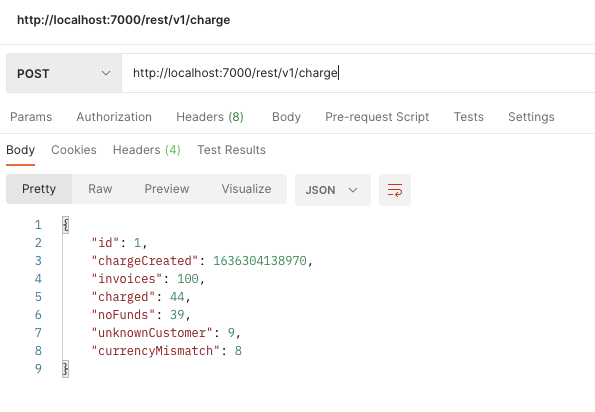
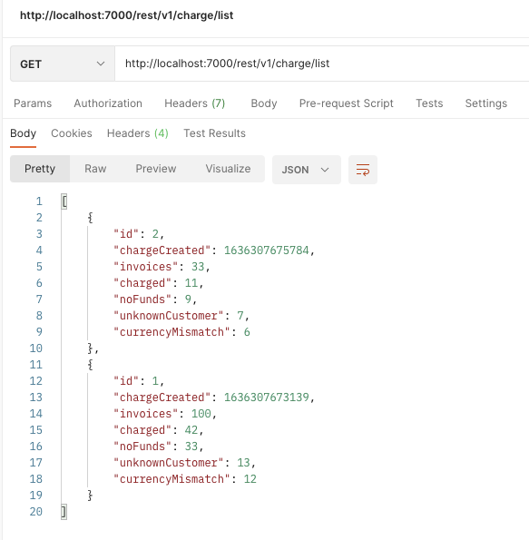
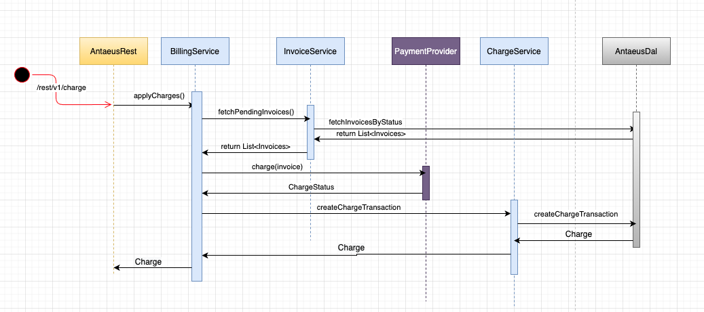

## Antaeus

Antaeus (/ænˈtiːəs/), in Greek mythology, a giant of Libya, the son of the sea god Poseidon and the Earth goddess Gaia. He compelled all strangers who were passing through the country to wrestle with him. Whenever Antaeus touched the Earth (his mother), his strength was renewed, so that even if thrown to the ground, he was invincible. Heracles, in combat with him, discovered the source of his strength and, lifting him up from Earth, crushed him to death.

Welcome to our challenge.

## The challenge

As most "Software as a Service" (SaaS) companies, Pleo needs to charge a subscription fee every month. Our database contains a few invoices for the different markets in which we operate. Your task is to build the logic that will schedule payment of those invoices on the first of the month. While this may seem simple, there is space for some decisions to be taken and you will be expected to justify them.

## Instructions

Fork this repo with your solution. Ideally, we'd like to see your progression through commits, and don't forget to update the README.md to explain your thought process.

Please let us know how long the challenge takes you. We're not looking for how speedy or lengthy you are. It's just really to give us a clearer idea of what you've produced in the time you decided to take. Feel free to go as big or as small as you want.

## Developing

Requirements:
- \>= Java 11 environment

Open the project using your favorite text editor. If you are using IntelliJ, you can open the `build.gradle.kts` file and it is gonna setup the project in the IDE for you.

### Building

```
./gradlew build
```

### Running

There are 2 options for running Anteus. You either need libsqlite3 or docker. Docker is easier but requires some docker knowledge. We do recommend docker though.

*Running Natively*

Native java with sqlite (requires libsqlite3):

If you use homebrew on MacOS `brew install sqlite`.

```
./gradlew run
```

*Running through docker*

Install docker for your platform

```
docker build -t antaeus
docker run antaeus
```

### App Structure
The code given is structured as follows. Feel free however to modify the structure to fit your needs.
```
├── buildSrc
|  | gradle build scripts and project wide dependency declarations
|  └ src/main/kotlin/utils.kt 
|      Dependencies
|
├── pleo-antaeus-app
|       main() & initialization
|
├── pleo-antaeus-core
|       This is probably where you will introduce most of your new code.
|       Pay attention to the PaymentProvider and BillingService class.
|
├── pleo-antaeus-data
|       Module interfacing with the database. Contains the database 
|       models, mappings and access layer.
|
├── pleo-antaeus-models
|       Definition of the Internal and API models used throughout the
|       application.
|
└── pleo-antaeus-rest
        Entry point for HTTP REST API. This is where the routes are defined.
```

### Main Libraries and dependencies

* [Exposed](https://github.com/JetBrains/Exposed) - DSL for type-safe SQL
* [Javalin](https://javalin.io/) - Simple web framework (for REST)
* [kotlin-logging](https://github.com/MicroUtils/kotlin-logging) - Simple logging framework for Kotlin
* [JUnit 5](https://junit.org/junit5/) - Testing framework
* [Mockk](https://mockk.io/) - Mocking library
* [Sqlite3](https://sqlite.org/index.html) - Database storage engine

Happy hacking 😁!

# Solution

It has being a challenging experience. I will try to describe my development journey sharing my thoughts and the decisions i took. This is the task
list i have followed during the challenge:

* understanding of business requirement to implement.
* initial code review for a better project structure
* researching about kotlin syntax, features and best practices (naming conventions,...)
* thinking on technical design, and researching for kotlin options to implement the technical goals i wanted to achieve.
* docker config to run the applications

## Technical highlights

When I face the challenge for the first time, I tried to identify the different points to explore for completing the solution:

a) <i>PaymentProvider</i> interface represents the external service with a third party service. There is a comment describing the different responses
from that system. I thought on implementing a thirdparty simulator to return all these possible responses. For this purpose I have implemented a
thirdparty simulator returning random responses (10% network issues, 10% customer not found, 10% currency mistmaching, 70% true/false response)

b) <i>Charging processor</i> can be run asynchronously, as charges are not dependent one to each other (i.e. do not need to complete a charge to run
the next one), and they can be run in parallel too.

c) When response from Payment provider is a network issue, retry the charge operation for that specific invoice. Prevent retry when issue is related
with Customer not found or currency mismatching errors.

d) A <i>scheduler</i> is required to fire the charge process. Thinking on a cron job or similar for this purpose.

Assumptions:

* Existing invoices in the system are for known customers with the proper currency. This checking should be responsible for the component in charge of
  creating new invoices in a real system.
* Third party service implements an idempotent REST api to prevent multiple charges for the same invoice in case more than one request is processed.

## Development experience

This is my first time dealing with Kotlin. It is a language that caught my attention in the past but, I had never the chance to practice in a real
project. Due to my lack of knowledge in Kotlin, I've spent the first hours of this code challenge researching about:

* Kotlin features,
* Kotlin best practices
* Javalin REST api library
* gradle (i've worked with maven normally)

Once I started with development, I spent some time researching for kotlin libraries to implement multithread asynchronous calls to the external
interface.</br>
I found <b>org.jetbrains.kotlinx:kotlinx-coroutines-core</b> library that fits for this purpose. Kotlin uses coroutines, they are light-weight
threads, so I explored this solution. I tried first with <b>async Flows</b> but I was not able to make it works properly, so I tried with <b>
runBlocking</b> and <b>async</b> features with successful results.

As I mentioned above, this is my first experience with Kotlin, therefore about my programming style, I'm sure my implementation is closer to Java
style rather than Kotlin one.</br>
I'm not really happy with InvoicesResult class. I'm sure there are better ways to implement it in a Kotlin fashion way, but no chance to spend more
time during the code challenge to improve my skills in Kt. Same feelings in BillingService. I'm sure there are better ways to write the same code.
Something I would like to learn in near future.

### REST api extension

Entrypoint to launch the charge process for all pending invoices:

```
curl --location --request POST 'http://localhost:7000/rest/v1/charge'
```

Response:



Entrypoint to list the charge results:

```
curl --location --request GET 'http://localhost:7000/rest/v1/charge/list'
```

Response:


This is a sequence diagram about the calls involved in the charge process:



## How to run

The solution is provided by two applications:

* antaeus_app: rest api service running in a docker container. it is exposing a POST /rest/v1/charge endpoint to process all pending invoices in the
  system. It will update the invoice status based on 3rd party response.
* antaeus_scheduler: cron job running in a different container. It contains a job to schedule requests to the new endpoint exposed in antaeus_app

### ./start-antaeus.sh

Firstly I worked in a script to run both docker containers because this way I can add a delay between both services startup, so, when
antaeus_scheduler is starting, antaeus_app is already started.

### ./start-docker-compose.sh

Later I have worked in a `docker-compose.yaml` file. I did not try this approach as first approach because I tried with no success to start
antaeus-scheduler once antaeus-app is up a running.</br>
Note that, this one is only for running both containers. Images must be created previously. No time to complete the docker-compose.yaml file with both
builds.

## Other approaches not implemented

I also considered but not implemented:

* Implement message queues for the charging process. A possible solution is to define different queue topics (i.e. currency code). Then, define
  different consumers to perform the charges for all pending invoices, group by currency code, through third party service

* Maybe some customers with account balance did not allow the charge, because maybe payroll is done after 1st of the month. A solution for this
  situation it could be to schedule more charge requests maybe on the 5th and the 10th of the month

* The new entrypoint should be secured via user access token or similar to be sure non trusted requests will be processed

## Finally

I have enjoyed a lot this code challenge. As I mentioned before, Kotlin caught my attention some time ago, and I had that pending debt to try it some
day. I would like to see what Kotlin can offer in a real application.

I also had special interest to try a different language apart from Java, and feel in first person how different languages resolve the same issues.

Time spent: 12h aprox

